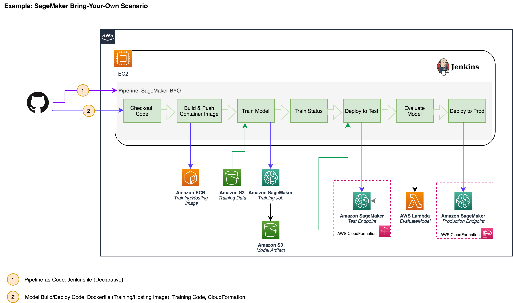
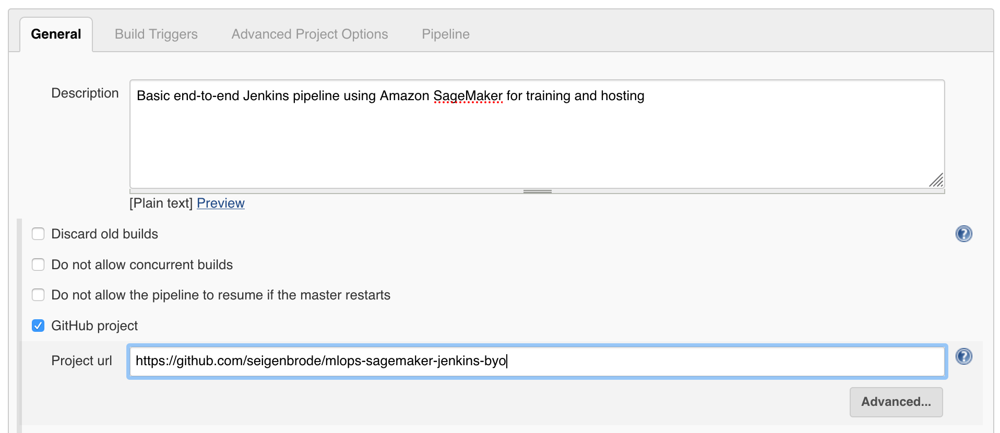

# MLOps: Jenkins & Bring-Your-Own-Algorithm

In this workshop, we will focus on building a pipeline to train and deploy a model using Amazon SageMaker training instances and hosting on persistent Sagemaker endpoint instance(s).  The orchestration of the training and deployment will be done through [Jenkins](https://www.jenkins.io/).  

Applying DevOps practices to Machine Learning (ML) workloads is a fundamental practice to ensure machine learning workloads are deployed using a consistent methodology with traceability, consistency, governance and quality gates. MLOps involves applying practices such as CI/CD,Continuous Monitoring, and Feedback Loops to the Machine Learning Development Lifecycle. 

This workshop will focus primarily on setting up a base deployment pipeline in Jenkins.  The expectation would be to continue to iterate on a base pipeline incorporating more quality checks and pipeline features including the consideration for a data worflow pipeline.  One component that we often see in a pipeline or between the hand-off of model build and model deploy activities is a model registry.   That is not in scope for this base pipeline but should be considered as you iterate on your pipeline.  

 There is no one-size-fits-all model for creating a pipeline; however, the same general concepts explored in this lab can be applied and extended across various services or tooling to meet the same end result.  

-----

## Workshop Contents

For this portion of the workshop, we will be building the following pipeline:  

The stages above are broken out into:

**Checkout:** Code is checked out from this repository 

**BuildPushContainer:** Container image is built using code pulled from Git and pushed to ECR

**TrainModel:** Using the built container image in ECR, training data, and configuration code this step starts the training job using Amazon SageMaker Training Instances

**TrainStatus:** Check if training was successful. Upon completion, packaged model artifact (model.tar.gz) will be PUT to S3 model artifact bucket.

**DeployToTest:** Package model, configure model test endpoint, and deploy test endpoint using Amazon SageMaker Hosting Instances

**SmokeTest:** Ensure we are able run prediction requests against deployed endpoint

**DeployToProd:** Package model, configure model production endpoint, and deploy production endpoint using AWS CloudFormation deploying to Amazon SageMaker Hosting Instances 

*Note: For this workshop, we are deploying to 2 environments (Test/Production). In reality, this number will vary depending on your environment and the workload.  For simplicity in the lab, we deploy both to a single AWS account.  However, AWS best practices for governance and workload isolation typically include deploy across accounts.*

The architecture used for the pipeline steps is shown below: 

-------
## Prerequisite

1) AWS Account & Administrator Access
2) Please use North Virginia, **us-east-1** for this workshop
3) This workshop assumes you have an existing installation of Jenkins or Cloudbees.  Because the distributions may vary in look & feel, the instructions may need to be revised for your installation.

------

## Lab Overview

This lab is based on the [scikit_bring_your_own](https://github.com/awslabs/amazon-sagemaker-examples/blob/master/advanced_functionality/scikit_bring_your_own/scikit_bring_your_own.ipynb) SageMaker example notebook.  Please reference the notebook for detailed description on the use case as well as the custom code for training, inference, and creating the docker container for use with SageMaker.  

Although Amazon SageMaker now has native integrations for [Scikit](https://aws.amazon.com/blogs/machine-learning/amazon-sagemaker-adds-scikit-learn-support/), this notebook example does not rely on those integrations so is representative of any BYO* use case.  

Using the same code (with some minor modifications) from the SageMaker example notebook, we will utilize this GitHub repository as our source repository and our SCM into our Jenkins pipeline. 

* *Optional: You can also choose to fork this repository if you want to modify code as part of your pipeline experiments. If you fork this repository, please ensure you update github configuration references within the lab* 

This lab will walk you through the steps required to setup a base pipeline responsible for orchestration of workflow to build and deploy custom ML models to target environments

For this lab, we will perform a lot of steps manually in AWS that would typically be performed through Infrastructure-as-Code using a service like [CloudFormation](https://aws.amazon.com/cloudformation/). For the purposes of the lab, we will go step-by-step on the console so attendees become more familiar with expected inputs and artifacts part of a ML deployment pipeline.  

## **IMPORTANT:  There are steps in the lab that assume you are using N.Virginia (us-east-1).  Please use us-east-1 for this workshop** 

---

# Workshop Setup & Preparation

The steps below are included for the setup of AWS resources we will be using in the lab environment.

## Step 1: Create Elastic Container Registry (ECR)

In this workshop, we are using Jenkins as the Docker build server; however, you can also choose to use a secondary build environment such as [AWS Code Build](https://aws.amazon.com/codebuild) as a managed build environment that also integrates with other orchestration tools such as Jenkins. Below we are creating an Elastic Container Registry (ECR) where we will push our built docker images. This images we push to this registry will become input container images used for our SageMaker training and deployment.   

1) Login to the AWS Account provided

2) Verify you are in **us-east-1/N.Virginia**

3) Go to **Services** -> Select **Elastic Container Registry**

4) Select **Create repository**

   * For **Repository name**: Enter a name (ex. jenkins-byo-scikit-janedoe)
   * Toggle the **Image scan settings** to **Enabled**  (*This will allow for automatic vulnerability scans against images we push to this repository*)

5) Click **Create repository**
6) Confirm your repository is in the list of repositories
7) You will need your repository URI in a later step so copy that URI for later. 

## Step 2: Create Model Artifact Repository

Create the S3 bucket that we will use as our packaged model artifact repository.  Once our SageMaker training job completes successfully, a new deployable model artifact will be PUT to this bucket. In this lab, we version our artifacts using the consistent naming of the build pipeline ID.  However, you can optionally enable versioning on the S3 bucket as well.  

1) From your AWS Account, go to **Services**-->**S3**

2) Click  **Create bucket**

3) Under **Create Bucket / General Configuration**:
 
   * **Bucket name:** *yourinitials*-jenkins-scikitbyo-modelartifact
     
      *Example: jd-jenkins-scikitbyo-modelartifact*

   * Leave all other settings as default, click **Create bucket**

## Step 3: Create Bucket for Training/Testing Data. Copy files to the Bucket

Create the S3 bucket that we will use for storing our test and train data.  The training job will use the train.csv from the bucket to train the model. The testing lambda function will use the test.csv to smoke test the end point

1) From your AWS Account, go to **Services**-->**S3**

2) Click  **Create bucket**

3) Under **Create Bucket / General Configuration**:
 
   * **Bucket name:** *yourinitials*-jenkins-scikitbyo-data
     
      *Example: jd-jenkins-scikitbyo-modelartifact*

   * Leave all other settings as default, click **Create bucket**
   
 4) Copy the train, test files from the data directory to the bucket : https://github.com/chethancmk/mlops-sagemaker-jenkins-byo/tree/master/data

## Step 4: Create SageMaker Execution Role

Create the IAM Role we will use for executing SageMaker calls from our Jenkins pipeline  

1) From your AWS Account, go to **Services**-->**IAM**

2) Select **Roles** from the menu on the left, then click **Create role**
3) Select **AWS service**, then **SageMaker**

4) Click **Next: Permissions**

5) Click **Next: Tags**

6) Click **Next: Review**

7) Under **Review**:

 * **Role name:** MLOps-Jenkins-SageMaker-ExecutionRole-*YourInitials*

8) Click **Create role**

9) You will receive a notice the role has been created, click on the link to the role and make sure grab the arn for the role we just created as we will use it later. 

10) We want to ensure we have access to S3 as well, so under the **Permissions** tab, click **Attach policies**

11) Type **S3** in the search bar and click the box next to 'AmazonS3FullAccess', click **Attach policy**

*Note: In a real world scenario, we would want to limit these privileges significantly to only the privileges needed.  This is only done for simplicity in the workshop.*

## Step 5: Create the Lambda Helper function

In this step, we'll create the Lambda Helper Functions that to facilitate the integration of SageMaker training and deployment into a Jenkins pipeline:

1. Go to **Services** -> Select **Lambda**
2. Create a function MLOps-InvokeEndpoint-scikitbyo with Python 3.8 as the run time. 
3. Upload the lambda zip code from the /lambdas folder of this repo  [Github Link](https://github.com/chethancmk/mlops-sagemaker-jenkins-byo/tree/master/lambda)
4. Update the Lambda permissions to have access to S3, Sagemaker and Clouwatch

The description of each Lambda function is included below:
 
-	**MLOps-InvokeEndpoint-scikitbyo:** This Lambda function is triggered during our "TestEvaluate" stage in the pipeline where we are checking to ensure that our inference code is in sync with our training code by running a few sample requests for prediction to the deployed test endpoint.  We are running this step before committing our newly trained model to a higher level environment.  

---

#  Build the Jenkins Pipeline

In this step, we will create a new pipeline that we'll use to:

   1) Pull updated training/inference code

   2) Create a docker image

   3) Push docker image to our ECR

   4) Train our model using Amazon SageMaker Training Instances
    
   5) Deploy our model to a Test endpoint using CloudFormaton to deploy to Amazon SageMaker Hosting Instances 

   6) Execute a smoke test to ensure our training and inference code are in sync

   7) Deploy our model to a Production endpoint using CloudFormaton to deploy to Amazon SageMaker Hosting Instances

## Step 5: Configure the Jenkins Pipeline

1) Login Jenkins portal using the information provided by your instructors

2) From the left menu, choose **New Item** 

3) **Enter Item Name:** sagemaker-byo-pipeline-*yourinitials* 

    *Example: sagemaker-byo-pipeline-jd

4) Choose **Pipeline**, click **OK**

5) Under **General** tab, complete the following: 

* **Description:** Enter a description for the pipeline

* Select **GitHub project** & Enter the following project url: https://github.com/seigenbrode/mlops-sagemaker-jenkins-byo

   * Scroll Down & Select **This project is parameterized**:
      -  select **Add Parameter** --> **String Parameter**
      -  **Name**: ECRURI
      -  **Default Value**: *Enter the ECR repository created above*

 * We're going to use the same process above to create the other configurable parameters we will use as input into our pipeline. Select **Add Parameter** each time to continue to add the additional parameters below: 

   *  Parameter #2: Lambda Execution Role
       - **Type:** String
       - **Name:** LAMBDA_EXECUTION_ROLE_TEST
       - **Default Value:** arn:aws:iam::*<InsertAccount#>*:role/MLOps-Jenkins-LambdaExecution

       *Tip: Your account number can be found in the ECRURI above*

   * Parameter #3: SageMaker Execution Role 
       - **Type:** String
       - **Name:** SAGEMAKER_EXECUTION_ROLE_TEST
       - **Default Value:** *Enter the ARN of the role we created above*

   * Parameter #4: Model Artifact Bucket 
       - **Type:** String
       - **Name:** S3_MODEL_ARTIFACTS
       - **Default Value:** *Enter the bucket we created above in the format: s3://*initials*-jenkins-scikitbyo-modelartifact

   * Parameter #5: Training Job Name 
       - **Type:** String
       - **Name:** SAGEMAKER_TRAINING_JOB
       - **Default Value:** scikit-byo-*yourinitials*

    * Parameter #6: S3 Bucket w/ Training Data
       - **Type:** String
       - **Name:** S3_TRAIN_DATA
       - **Default Value:** s3://0.model-training-data/train/train.csv     

    * Parameter #7: S3 Bucket w/ Training Data
       - **Type:** String
       - **Name:** S3_TEST_DATA
       - **Default Value:** 0.model-training-data    

    * Parameter #8: Lambda Function - Smoke Test
       - **Type:** String
       - **Name:** LAMBDA_EVALUATE_MODEL
       - **Default Value:** MLOps-InvokeEndpoint-scikitbyo

   * Parameter #9: Default Docker Environment
       - **Type:** String
       - **Name:** JENKINSHOME
       - **Default Value:** /bitnami/jenkins/jenkins_home/.docker
   

5) Scroll down --> Under **Build Triggers** tab: 

  * Select **GitHub hook trigger for GITScm polling**

6) Scroll down --> Under **Pipeline** tab: 

   * Select **Pipeline script from SCM**

   * **SCM:** Select **Git** from dropdown

   * **Repository URL:** https://github.com/seigenbrode/mlops-sagemaker-jenkins-byo

   * **Branches to Build:** */main

   * **Credentials:** -none- *We are pulling from a public repo* 

   * **Script Path:** *Ensure 'Jenkinsfile' is populated*

7) Leave all other values default and click **Save**

We are now ready to trigger our pipeline.  But first, let's explore the purpose of Jenkinsfile.  Jenkins allows for many types of pipelines such as free style projects, pipelines (declarative / scripted), and external jobs.  In our original setup we selected [Pipeline](https://www.jenkins.io/doc/book/pipeline/getting-started/).  Our Git Repository also has a file named *Jenksfile* which contains the scripted flow of stages and steps for our pipeline in Jenkin's declarative pipeline language.  This is often referred to as pipeline-as-code as we can programmatically modify our pipelines and also ensure it remains under source control.

---

## Step 6: Trigger Pipeline Executions

In this step, we will execute the pipeline manually and then we will later demonstrate executing the pipeline automatically via a push to our connected Git Repository.  

Jenkins allows for the ability to create additional pipeline triggers and embed step logic for more sophisticated pipelines.Another common trigger would be for retraining based on a schedule, data drift, or a PUT of new training data to S3. 

1. Let's trigger the first execution of our pipeline. While you're in the Jenkins Portal, select the pipeline you created above:  

2. Select **Build with Parameters** from the left menu:

3. You'll see all of the parameters we setup on initial configuration, you could change these values prior to a new build but we are going to leave all of our defaults, then click **Build** 

4. You can monitor the progress of the build through the dashboard as well as the stages/steps being setup and executed.  An example of the initial build in progress below: 

*Note: The progress bar in the lower left under Build History will turn a solid color when the build is complete. 

5. Once your pipeline completes the **BuildPushContainer** stage, you can go view your new training/inference image in the repository we setup: Go To [ECR](https://console.aws.amazon.com/ecr/repositories). Because we turned on vulnerability scanning, you can also see if your image has any vulnerabilities.  This would be a good place to put in a quality gate, stopping the build until the vulnerabilities are addressed: 

6. When your pipeline reaches the **TrainModel** stage, you can checkout more details about your model training within SageMaker.  While we use Jenkins to orchestrate the kickoff of our training, we are still utilizing Amazon SageMaker training features &  instances for this step.  Go To [Amazon SageMaker Training Jobs](https://console.aws.amazon.com/sagemaker/home?region=us-east-1#/jobs).  You can click on your job and review the details of your training job as well as check out the system monitoring metrics.  

7. When the pipeline has completed the **TrainStatus** stage, the model has been trained and you will be able to find your deployable model artifact in the S3 bucket we created earlier.  Go To [S3](https://s3.console.aws.amazon.com/s3/home?region=us-east-1) and find your bucket to view your model artifact: *yourinitials*-jenkins-scitkitbyo-modelartifact

8. When the pipeline has completed, the model that was trained once is deployed to test, run through a smoke test, and deploy to production.  Go to [Amazon SageMaker Endpoints](https://console.aws.amazon.com/sagemaker/home?region=us-east-1#/endpoints) to check out your endpoints.  

**CONGRATULATIONS!** 

You've setup your base Jenkins pipeline for building your custom machine learning containers to train and host on Amazon SageMaker.  You can continue to iterate and add in more functionality including items such as: 

 * A/B Testing 
 * Model Registry
 * Data Pre-Processing 
 * Feature Store Integration
 * Additional Quality Gates
 * Retraining strategy
 * Include more sophisticated logic in the pipeline such as [Inference Pipeline](https://docs.aws.amazon.com/sagemaker/latest/dg/inference-pipelines.html), [Multi-Model Endpoint](https://docs.aws.amazon.com/sagemaker/latest/dg/multi-model-endpoints.html)

---

## Step 5: Clean-Up

If you are performing work in your own AWS Account, please clean up resources you will no longer use to avoid unnecessary charges. 

